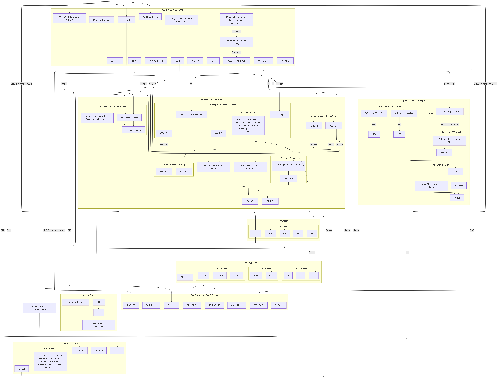

The final goal is to reduce energy consumption of a house, achieving off-grid when needed, by using solar PV hybrid inverter that connects to a small stationary battery (5-20kWh) and V2H to a car battery (80kWh).
Calculated economization goes from 80% to 90%, simulated via https://pedroportelareis.blogspot.com/2024/06/paineis-solares-fotovoltaicos-parte-3.html.

- v4 - EV charge & V2H simplest.drawio.png - global plan
- mermaid-diagram-v10-2025-05-30-220203.png - draft plan for the connection between the hybrid inverter and the car.

